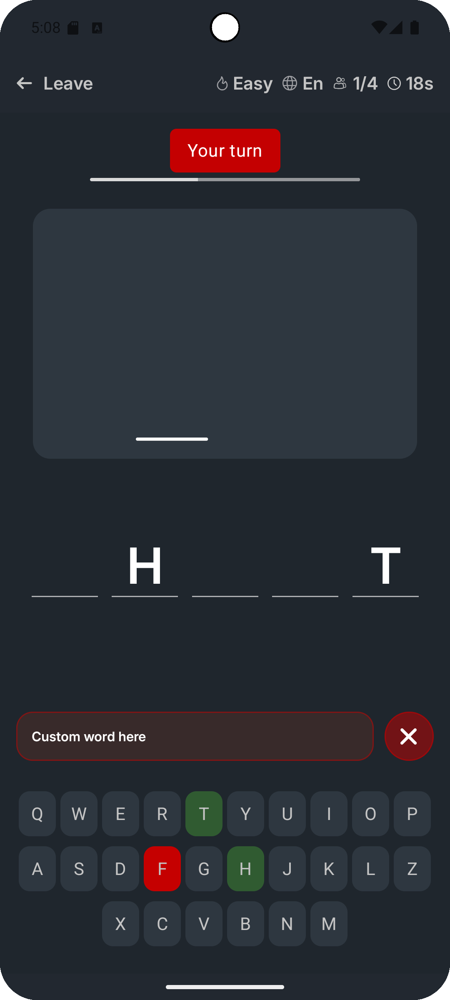
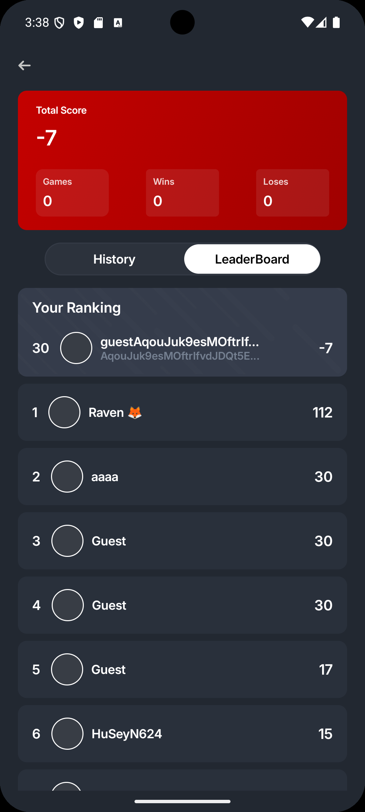

# 🏆 WordPuzzleGame (Real-Time Multiplayer Word Game + Clean Architecture + MVI + Hilt + Jetpack Compose + SOLID)

**WordsApp** is a modern, **real-time multiplayer Android application** built with Kotlin. Users can compete against each other in word-guessing games, manage game history, and enjoy a dynamic, interactive experience.  

It uses **MVI (Model-View-Intent)** and **Clean Architecture**, along with **Room**, **Kotlin Coroutines**, **Hilt**, and **Jetpack Compose** for a fully declarative, reactive, and maintainable UI.

---

## 📸 Screenshots & Demo

| Demo/GİF | Sign In | Sign Up | Home |
|--------------|-----------|-------------|-------------|
|  |  |  | |

| Home İnfo | Game Screen | Game Guess | Game History |
|--------------|-----------|-------------|-------------|
|  |   |   |   |

| Game Detail | Game Leaderboard |
|-------------|-------------|
| | |

---

## 🏠 App Screens and Functionality

### 1. Splash, Onboarding & Authentication
- **Splash Screen:** Checks login status and directs user appropriately.  
- **Onboarding Screen:** Guides new users to sign-up/sign-in.  
- **Sign-Up & Sign-In:** Email/password + Google Sign-In using AndroidX Credentials library.

### 2. Home Screen (Game Lobby)
- **Game Room Browser:** Lists available game rooms.  
- **Real-time Updates:** Current players and game status are shown live.  
- **Create & Join Rooms:** Start a new game or join existing sessions.  
- **Navigation:** Bottom navigation for Home, History, Profile.

### 3. Game Screen
- **Multiplayer Gameplay:** Users compete in real-time word-guessing games.  
- **Interactive UI:** Word input, timer, scores, hints, round results — all synchronized in real-time.

### 4. History Screen
- **Game Log:** Displays past games from local Room database.  
- **Match Details:** Tap to view detailed statistics.  
- **Offline Access:** History is available without internet.

### 5. History Detail Screen
- **In-Depth Stats:** Breakdown of scores, words played, player performance.

### 6. Profile Screen
- **User Info:** Displays account data.  
- **Sign Out:** Secure logout and session clearing.

---

## 🧠 Technologies Used

| Technology | Purpose |
|------------|---------|
| Kotlin | Core programming language |
| Kotlin Coroutines | Async tasks and real-time flows |
| Flow / StateFlow | Reactive streams from DB and server events |
| MVI | Unidirectional state management |
| Clean Architecture | Separation of concerns (UI, Domain, Data) |
| Hilt | Dependency Injection |
| Jetpack Compose | Declarative UI |
| Room Database | Offline storage of game history |
| Google Sign-In | Secure authentication |
| ViewModel | UI-related data management |
| Jetpack Navigation | Screen transitions |
| Coil | Image loading |
| Material Design 3 | UI design system |
| Kotlinx Serialization | JSON parsing for real-time data |

---

## ⚙️ Core Features

✅ **Real-Time Multiplayer:** Live word games with other players  
✅ **Full Authentication:** Email/password + Google sign-in  
✅ **Game History:** Auto-saves all completed games  
✅ **Offline-First History:** Access past games offline  
✅ **Reactive UI:** State updates instantly with Flow  
✅ **MVI Pattern:** Predictable, debuggable state management  
✅ **Clean Architecture:** Easy to maintain, test, and scale  
✅ **Dependency Injection:** Hilt for modularity  

---

## 🧱 Project Architecture

### 1. UI Layer (Presentation)
- Screens & ViewModels:
  - `LoginScreen`, `SignUpScreen` → `AuthViewModel`  
  - `HomeScreen` → `HomeViewModel`  
  - `GameScreen` → `GameViewModel`  
  - `HistoryScreen` → `HistoryViewModel`  
  - `HistoryDetailScreen` → `HistoryDetailViewModel`  
  - `ProfileScreen` → `ProfileViewModel`  
- **State Management:** Each feature defines `State`, `Event`, and `Navigation` classes.  
- **Mappers:** Converts domain models → UI models (`toUi`).

### 2. Domain Layer
- Use Cases:
  - `JoinGameUseCase`, `SubmitWordUseCase`, `GetHistoryUseCase`, `SignInUseCase`, etc.  
- Pure Kotlin business logic, independent of UI/Data layers.

### 3. Data Layer
- **Repositories:** `GameRepositoryImpl`, `AuthRepositoryImpl`  
- **Data Sources:**  
  - Remote: Real-time server (WebSocket)  
  - Local: Room database (`HistoryDao`, `UserDao`)  
- **Entities:** `HistoryEntity`, `UserEntity`  
- **Mappers:** Data → Domain conversion (`toDomain`)

---

## 🔁 Coroutine & Data Flow
1. Data Sources emit `Flow` (Room + real-time server).  
2. Repository maps entities to domain models.  
3. Use Cases apply business logic.  
4. ViewModel collects Flow in `viewModelScope`, updates `StateFlow`.  
5. Compose UI collects `StateFlow` → auto recomposition.

---

├── build.gradle.kts
├── settings.gradle.kts
├── core
│ ├── build.gradle.kts
│ └── src
│ └── main
│ └── java/com/example/core
│ ├── data
│ │ ├── local
│ │ │ └── PrefsManager.kt
│ │ └── remote
│ │ └── NetworkModule.kt
│ ├── domain
│ │ └── model
│ │ └── Result.kt
│ └── util
│ └── Mapper.kt
├── features
│ ├── home
│ │ ├── build.gradle.kts
│ │ └── src
│ │ └── main
│ │ └── java/com/example/feature/home
│ │ ├── data
│ │ │ ├── repository
│ │ │ │ └── HomeRepositoryImpl.kt
│ │ │ └── source
│ │ │ └── HomeApi.kt
│ │ ├── domain
│ │ │ ├── model
│ │ │ │ └── HomeItem.kt
│ │ │ └── usecase
│ │ │ └── GetHomeItemsUseCase.kt
│ │ └── presentation
│ │ ├── HomeViewModel.kt
│ │ └── HomeScreen.kt
│ ├── signup
│ │ ├── build.gradle.kts
│ │ └── src
│ │ └── main
│ │ └── java/com/example/feature/signup
│ │ ├── data
│ │ │ └── auth
│ │ │ └── AuthRemoteDataSource.kt
│ │ ├── domain
│ │ │ └── usecase
│ │ │ └── SignUpUseCase.kt
│ │ └── presentation
│ │ ├── SignUpViewModel.kt
│ │ └── SignUpScreen.kt
│ └── common-ui
│ ├── build.gradle.kts
│ └── src
│ └── main
│ └── java/com/example/feature/commonui
│ └── components
│ └── ButtonPrimary.kt
└── app
├── build.gradle.kts
└── src
└── main
└── java/com/example/app
├── MainActivity.kt
└── NavGraph.kt

## 🚀 Getting Started

```bash
git clone https://github.com/AminAbbasov778/WordPuzzleGame.git
Open the project in Android Studio

Configure Google Sign-In:

Create Firebase project

Add google-services.json to app/ folder

Run the app on emulator or device
